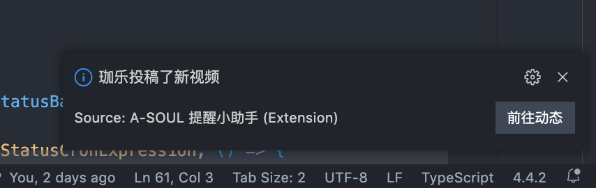
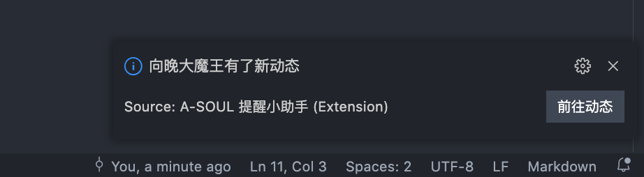

# A-SOUL 提醒小助手

[](https://marketplace.visualstudio.com/items?itemName=JiangYan.asoul-notifications)
[](https://marketplace.visualstudio.com/items?itemName=JiangYan.asoul-notifications)
[](https://marketplace.visualstudio.com/items?itemName=JiangYan.asoul-notifications)

[](https://github.com/luooooob/vscode-asoul-notifications/actions/workflows/ci.yml)
[](https://github.com/luooooob/vscode-asoul-notifications)
[](https://github.com/luooooob/vscode-asoul-notifications/blob/master/LICENSE)

> 

## 功能

### 新动态提醒





### 正在直播提醒


可以自定义昵称


### 新抖音短视频提醒

(别急, 正在新建文件夹)


## 设置

- `asoulNotifications.asoulMembers`
  
  ```json
  [
    {
      "nickname": "向晚",
      "bilibiliId": 672346917,
      "douyinId": "MS4wLjABAAAAxCiIYlaaKaMz_J1QaIAmHGgc3bTerIpgTzZjm0na8w5t2KTPrCz4bm_5M5EMPy92"
    },
    {
      "nickname": "拉姐",
      "bilibiliId": 672353429,
      "did": "MS4wLjABAAAA5ZrIrbgva_HMeHuNn64goOD2XYnk4ItSypgRHlbSh1c"
    },

    ...

  ]
  ```
  一个数组, 记录所有成员的 bilibili 和抖音的 id 以及自定义昵称. 可以自行添加更多项(不推荐添加太多，本插件采用轮询 b 站公开接口的方式工作, 如果任务太多可能会被叔叔 gank). 三个键都是可选的, 如果没有`nickname`, 会默认使用该平台的 id, 如果没有平台的 `id`, 则没有该平台的通知

- `asoulNotifications.bilibiliLiveStatus.enabled`

  打开/关闭正在直播提醒

- `asoulNotifications.bilibiliNewDynamics.enabled`

  打开/关闭新动态提醒

## 反馈

插件正在开发中, 可能会出现不稳定的现象, 任何任何 bug 或建议可以通过 [issue](https://github.com/luooooob/vscode-asoul-notifications/issues/new) 反馈, 关于本插件的功能有更好的想法和建议也欢迎告知
